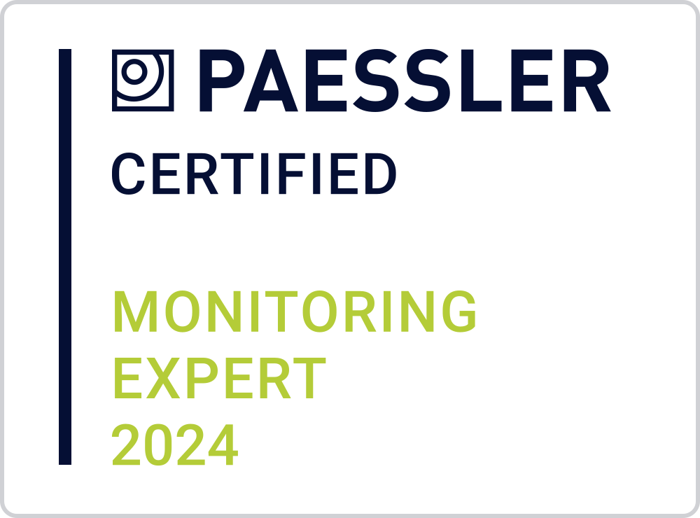

# Paulo Ricardo - Engcompaulo

<!--  -->

   
   ## Hello there! ✌🏻  
    
   
Olá, sou apenas um pequeno desenvolvedor, um apaixonado por tecnologia, navego em aguas profundas da TI, como Computação em Nuvem, Inteligencia Artificial, IoT e assim vai...  

    
   
Hello, I'm just a small developer, passionate about technology, I navigate deep waters of IT, like Cloud Computing, Artificial Intelligence, IoT and so on ...</p?

 
 

<a href="https://stackoverflow.com/users/10944644/engcompaulo">Meu perfil do Stackoverflow</a> 

<a href="https://www.engcompaulo.com.br/">Meu site pessoal</a>
 

## Estatísticas 

<a href="https://github.com/anuraghazra/github-readme-stats">
  <!-- Change the `github-readme-stats.anuraghazra1.vercel.app` to `github-readme-stats.vercel.app`  -->
  
</a>

 <!-- Não funciona mais-->
 ## Certificações
 

 
 
  
  
 

 ## Ferramentas e Tecnologias
 <!-- Liugar para pegar icones https://cdn.jsdelivr.net/gh/walkxcode/dashboard-icons/png/-->
  
 
    
    
    
    
    
    
    
    
    
    
    
    
    
    
    
    
    
    
    
    
    
    
    
    
    
    
    
    
    
    
    
    
    
    
    
    
    
    
    
    
    
    
    
         
  

  
  ## Conquistas e realizações
  
