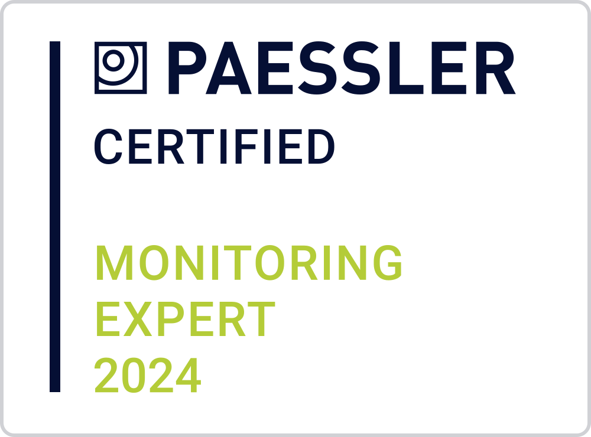

# Paulo Ricardo - Engcompaulo

<!--  -->

   
   ## Hello there! ✌🏻  
    
   
Sou um profissional DevOps com vasta experiência em automação de processos, integração contínua e gerenciamento de infraestrutura em nuvem. Especializo-me em otimizar o fluxo de trabalho de desenvolvimento, garantindo entregas rápidas e seguras.  

    
   
I am a DevOps professional with extensive experience in process automation, continuous integration, and cloud infrastructure management. I specialize in optimizing development workflows, ensuring fast and secure deliveries.

 
 

  <a href="https://stackoverflow.com/users/10944644/engcompaulo" target="_blank" style="
      display: inline-flex;
      align-items: center;
      gap: 8px;
      background-color: #f48024;
      color: white;
      font-weight: bold;
      padding: 8px 14px;
      border-radius: 10px;
      text-decoration: none;
      transition: 0.3s;
    ">
    
    Stack Overflow
  </a>

  <a href="https://www.engcompaulo.com.br/" target="_blank" style="
      display: inline-flex;
      align-items: center;
      gap: 8px;
      background-color: #0077b5;
      color: white;
      font-weight: bold;
      padding: 8px 14px;
      border-radius: 10px;
      text-decoration: none;
      transition: 0.3s;
    ">
    
    Meu site pessoal
  </a>

## Estatísticas 

<a href="https://github.com/anuraghazra/github-readme-stats">
  <!-- Change the `github-readme-stats.anuraghazra1.vercel.app` to `github-readme-stats.vercel.app`  -->
  
</a>

 <!-- Não funciona mais-->
 ## Certificações
 

 
 
  
  
 

 ## Ferramentas e Tecnologias
 <!-- Liugar para pegar icones https://cdn.jsdelivr.net/gh/walkxcode/dashboard-icons/png/-->
<!--## 🧰 Ferramentas e Tecnologias

### ☁️ Cloud & DevOps

---

### 🧩 Linguagens & Frameworks

---

### 🧠 Monitoramento & Observabilidade

---

### 💻 Sistemas & Infraestrutura

---

### 🧪 Outros

-->

<!-- fonte dos incones https://github.com/inttter/md-badges -->

  
  ## Conquistas e realizações
  
## Atualização
#### Bio atualizada em: 21/10/2025
